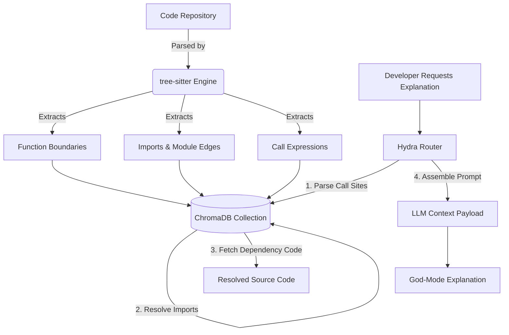

<div align="center">
  
  
  # 🌌 Astra Vision
  ### *The Autonomous AI Code Review, Semantic Graphing & Self-Healing Sandbox Engine*

  [](https://react.dev/)
  [](https://fastapi.tiangolo.com/)
  [](https://microsoft.github.io/monaco-editor/)
  [](https://www.trychroma.com/)
  [](https://tree-sitter.github.io/tree-sitter/)
  
  ---
  
  **Astra Vision** is a professional, repository-scale AI pair programming environment. It integrates deterministic Abstract Syntax Tree (AST) analysis, a persistent vector database, inline Monaco editor markers, and isolated code execution environments to deliver automated, verified codebase enhancements.
</div>

---

## 🌟 Capabilities Matrix: Astra Vision vs. Competitors

| Feature | Astra Vision | CodeRabbit / Greptile | Standard LLM Tools |
| :--- | :---: | :---: | :---: |
| **Deterministic Code Graphing** | **Yes (AST via `tree-sitter`)** | Partial (Heuristic/Files) | No |
| **Verification Sandboxing** | **Yes (Node.js & Python Exec)** | No | No |
| **Recursive Context Resolution** | **Yes (Graph Dependency Walk)** | No | No |
| **Inline Editor Diagnostics** | **Yes (Monaco markers)** | No (PR Comments only) | No |
| **Autonomous Self-Healing** | **Yes (Generate → Fail → Heal → Pass)** | No | No |
| **Multi-Provider Fallbacks** | **Yes (Hydra Protocol Routing)** | No | No |

---

## 🚀 Key Innovation Pillars (Under the Hood)

### 🧠 1. Hydra Protocol Multi-Model Routing
Astra Vision coordinates specialized LLM engines through the **Hydra Protocol** based on speed, reasoning capabilities, and token budgets:

*   **Speed Layer (Cerebras - gpt-oss-120b)**: Dispatches instant, sub-second responses for interactive code explanation and logic flows.
*   **Reasoning Layer (Nvidia NIM - nemotron-3-ultra-550b-a55b)**: Utilizes reasoning budget tokens to scan code changes (Git diffs) for deep-seated security flaws, race conditions, memory leaks, and architectural issues.
*   **Healing Layer (Google AI Studio - Gemini-2.5-Flash)**: Orchestrates recursive token generation to construct tests, execute sandbox runs, and emit structural code repairs.

---

### 🕸️ 2. AST Dependency Graphing & ChromaDB Indexing
Rather than splitting files using standard character counters, Astra Vision analyzes the **Abstract Syntax Tree (AST)** using tree-sitter bindings for JavaScript and Python:



#### How Metadata-Guided Context Works
When a file is indexed, each function is parsed into a separate ChromaDB document. Its metadata is enriched with structural references:
```json
{
  "filename": "src/app.js",
  "name": "startApp",
  "type": "function",
  "start_line": 4,
  "end_line": 12,
  "calls": "helper,validateInput",
  "imports": "./utils,./validator"
}
```
If a developer asks to explain `startApp()`, Astra Vision detects the calls to `helper` and `validateInput`, queries ChromaDB for functions matching those names, and automatically appends their source definitions into the LLM context.

---

### 🎨 3. Monaco Inline Diagnostics
Injects warnings directly into the editor viewport to avoid context-switching:
1.  **Severity Mapping**:
    *   `Critical` ➔ `monaco.MarkerSeverity.Error` (Red squiggly)
    *   `Warning` ➔ `monaco.MarkerSeverity.Warning` (Yellow/Orange squiggly)
    *   `Optimization` ➔ `monaco.MarkerSeverity.Info` (Blue squiggly)
    *   `Style` ➔ `monaco.MarkerSeverity.Hint` (Faded underline)
2.  **Coordinates Mapping**: Dynamically calculates character offsets and non-whitespace starts for each line to align underlines with code tokens.
3.  **Active Hover tooltips**: Hovering over underlined code segments displays a hover popup styled with the `[Astra Vision]` tag and issue details.

---

### ⚡ 4. The Self-Healing Sandbox Cycle
The self-healing cycle runs entirely in local, isolated subprocess sandboxes:

```
                  ┌─────────────────────────────┐
                  │    Code Snippet + Bug       │
                  └──────────────┬──────────────┘
                                 │
                   [Step 1: Write Assertion Test]
                                 │
                  ┌──────────────▼──────────────┐
                  │  Run Test in Subprocess    │
                  │   - JS: Node.js             │
                  │   - Py: Python Exec         │
                  └──────────────┬──────────────┘
                                 │
                        Is Test Failing?
                       /                \
                     YES                NO (Adjust test)
                     /
         [Step 2: Generate Fix]
                   /
     ┌────────────▼─────────────┐
     │  Re-run Test with Fix    │
     └────────────┬─────────────┘
                  │
          Did Test Pass?
         /              \
       YES               NO (Loop/Retry)
       /
┌─────▼─────────────────────────┐
│ Renders Diff & Patch Buttons  │
└───────────────────────────────┘
```

*   **JavaScript Sandbox**: Spawns `node -e <code>` using a 5-second hard timeout constraint.
*   **Python Sandbox**: Spawns `python -c <code>` with strict execution boundaries.
*   **Assertion-based confirmation**: Tests do not require third-party frameworks like Jest or pytest. Gemini generates pure assertions (`console.assert` or `assert`) and flags execution status with `__TEST_PASSED__` and `__TEST_FAILED__` output tokens.

---

## 📂 Repository Directory Tree

```bash
├── backend/
│   ├── services/
│   │   ├── ast_parser.py           # tree-sitter JS/Python parser & call site extractor
│   │   ├── code_indexer.py         # ChromaDB semantic indexing manager
│   │   ├── hydra_router.py         # Multi-provider model router (Cerebras, NIM, Gemini)
│   │   └── self_heal_engine.py     # Subprocess sandbox code executor
│   ├── server.py                   # FastAPI routing server
│   └── requirements.txt            # Python dependencies (tree-sitter, chromadb)
│
├── frontend/
│   ├── src/
│   │   ├── utils/
│   │   │   └── analysisEngine.js   # Local simulation fallback helpers
│   │   ├── App.js                  # App layout, Monaco mounts & markers syncing
│   │   └── index.js                # React entry
│   └── package.json                # Frontend package manifest
│
├── test_ast_parser.py              # CLI test for AST parser imports & calls extraction
├── test_ast_indexing.py            # CLI test for ChromaDB metadata graph storage
└── test_self_heal.py               # CLI test for the self-healing sandbox pipeline
```

---

## 🔌 API Documentation

### 1. Repository Indexing
*   **Endpoint**: `POST /api/index-repo`
*   **Payload**:
    ```json
    {
      "files": {
        "src/app.js": "function start() { helper(); }",
        "src/utils.js": "export function helper() { console.log('work'); }"
      }
    }
    ```
*   **Response**:
    ```json
    {
      "success": true,
      "data": {
        "success": true,
        "indexed_chunks": 2
      }
    }
    ```

### 2. Autonomous Self-Healing
*   **Endpoint**: `POST /api/self-heal`
*   **Payload**:
    ```json
    {
      "code": "function greet(name) { return 'Hello ' + name; }",
      "audit_comment": "String concatenation is security risk. Use template literals instead.",
      "language": "javascript"
    }
    ```
*   **Response**:
    ```json
    {
      "success": true,
      "data": {
        "test_code": "function greet(name) { ... }; try { console.assert(...); console.log('__TEST_PASSED__'); } ...",
        "fail_result": { "success": true, "passed": false, "stdout": "__TEST_FAILED__", "stderr": "..." },
        "fixed_code": "function greet(name) {\n  return `Hello ${name}`;\n}",
        "pass_result": { "success": true, "passed": true, "stdout": "__TEST_PASSED__", "stderr": "" }
      }
    }
    ```

---

## 🛠️ Setup & Execution

### Environment Variables
Create a `.env` file in the `backend/` directory:
```env
CEREBRAS_API_KEY="your-key"
NVIDIA_API_KEY="nvapi-..."
GEMINI_API_KEY="AIzaSy..."
```

### Running Astra Vision
A shell script launcher is included at the workspace root to orchestrate execution:
```bash
# Executing standard Windows Launcher
./start_astra_vision.bat
```

To run manually:
```bash
# Terminal 1: Python API Server
cd backend
python server.py

# Terminal 2: React Web Frontend
cd frontend
npm install
npm start
```

---

## 🔬 CLI Diagnostic Suites
Run these scripts to inspect engine operations directly in your command line:

```bash
# Run tree-sitter AST extraction
python test_ast_parser.py

# Run ChromaDB graph metadata search
python test_ast_indexing.py

# Run self-healing test assertions lifecycle
python test_self_heal.py
```
