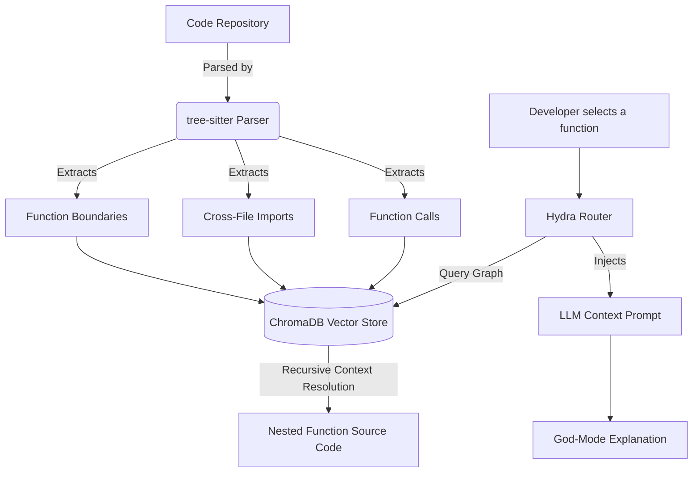

<div align="center">
  
  
  # 🌌 Astra Vision
  ### *Autonomous AI Code Review, Semantic Graphing & Self-Healing Sandbox Engine*

  [](https://react.dev/)
  [](https://fastapi.tiangolo.com/)
  [](https://microsoft.github.io/monaco-editor/)
  [](https://www.trychroma.com/)
  [](https://tree-sitter.github.io/tree-sitter/)
  
  ---
  
  **Astra Vision** is a state-of-the-art AI-powered pair programming environment. It goes far beyond typical chat widgets and generic LLM overlays by executing autonomous dependency graphing, inline Monaco editor diagnostics, and self-healing test sandboxes directly on your workspace.
</div>

---

## 🚀 Key Innovation Pillars

### 🧠 1. Hydra Protocol Multi-Model Routing
Astra Vision implements a hybrid, low-latency, high-reasoning model router. Instead of relying on a single general model, workloads are dynamically orchestrated across three specialized providers:

*   **Cerebras (gpt-oss-120b)**: Speed-optimized router for ultra-fast inline code explanations and interactive logic simulator runs.
*   **Nvidia NIMs (nemotron-3-ultra-550b-a55b)**: Deep-thinking agent utilizing reasoning tokens for comprehensive security, memory leak, and performance reviews.
*   **Google AI Studio (Gemini-2.5-Flash)**: High-concurrency fallback model optimized for self-healing code generation and AST metadata verification.

---

### 🕸️ 2. AST Dependency Graphing (`tree-sitter`)
Unlike typical code search engines that guess files via keyword embeddings, Astra Vision builds a deterministic **Abstract Syntax Tree (AST)** database of your codebase:



*   **Precise Chunking**: Chunks align perfectly with functional AST code blocks instead of arbitrary character limits.
*   **Recursive Context Resolution**: When analyzing code, the router automatically traverses import statements and function call sites, retrieving definitions of dependencies across separate files and feeding them into the LLM context.

---

### 🎨 3. Monaco Inline Diagnostics
Brings static analysis directly to the browser. As soon as a PR audit finishes:
*   Critical issues, warnings, and optimization ideas are painted directly onto code lines using squiggly underlines.
*   Hovering over lines shows descriptive tooltips with `[Astra Vision]` warning tags.
*   Clicking a diagnostic sidebar card automatically pans the viewport and highlights the line.

---

### ⚡ 4. Self-Healing Sandboxes
Astra Vision doesn't just suggest fixes—it **proves** they work by running tests in isolated sandboxes:

```
[PR Audit Warning Card]
         ↓ Click "Run & Heal"
[Step 1: Gemini generates failing unit test assertions]
         ↓
[Step 2: Subprocess executes test on original code] ──> EXPECT FAIL (❌)
         ↓
[Step 3: Gemini heals code based on failure output]
         ↓
[Step 4: Subprocess re-runs test on fixed code]   ──> EXPECT PASS (✅)
         ↓
[Apply Fix to Editor button renders green diff]
```

---

## 📂 Repository Directory Tree

```bash
├── backend/
│   ├── services/
│   │   ├── ast_parser.py           # tree-sitter JS/Python parser
│   │   ├── code_indexer.py         # ChromaDB semantic vector search indexer
│   │   ├── hydra_router.py         # Multi-provider model manager
│   │   └── self_heal_engine.py     # Subprocess execution & testing engine
│   ├── server.py                   # FastAPI application endpoint routing
│   └── requirements.txt            # Python backend dependencies
│
├── frontend/
│   ├── src/
│   │   ├── utils/
│   │   │   └── analysisEngine.js   # Local simulation utilities
│   │   ├── App.js                  # Main UI & Monaco Editor implementation
│   │   └── index.js                # App entrypoint
│   └── package.json                # React frontend dependencies
│
├── test_ast_parser.py              # CLI test for AST parsing logic
├── test_ast_indexing.py            # CLI test for ChromaDB metadata links
└── test_self_heal.py               # CLI test for self-healing sandboxing
```

---

## 🛠️ Installation & Setup

### Environment Variables
Create a `.env` file in `backend/` and supply your credentials:
```env
CEREBRAS_API_KEY="your-cerebras-key"
NVIDIA_API_KEY="nvapi-..."
GEMINI_API_KEY="AIzaSy..."
```

### Running Astra Vision
A batch launcher is included at the root of the project to spawn both backend and frontend concurrently:
```bash
# Double-click or run from PowerShell
./start_astra_vision.bat
```

To run manually:
```bash
# Terminal 1: FastAPI Backend
cd backend
python server.py

# Terminal 2: React Frontend
cd frontend
npm install
npm start
```

---

## 🔬 Test Suites
To verify the engine's core capabilities in the terminal:

```bash
# Verify tree-sitter AST extraction
python test_ast_parser.py

# Verify ChromaDB metadata graphing
python test_ast_indexing.py

# Verify Self-Healing Sandbox test loop
python test_self_heal.py
```
