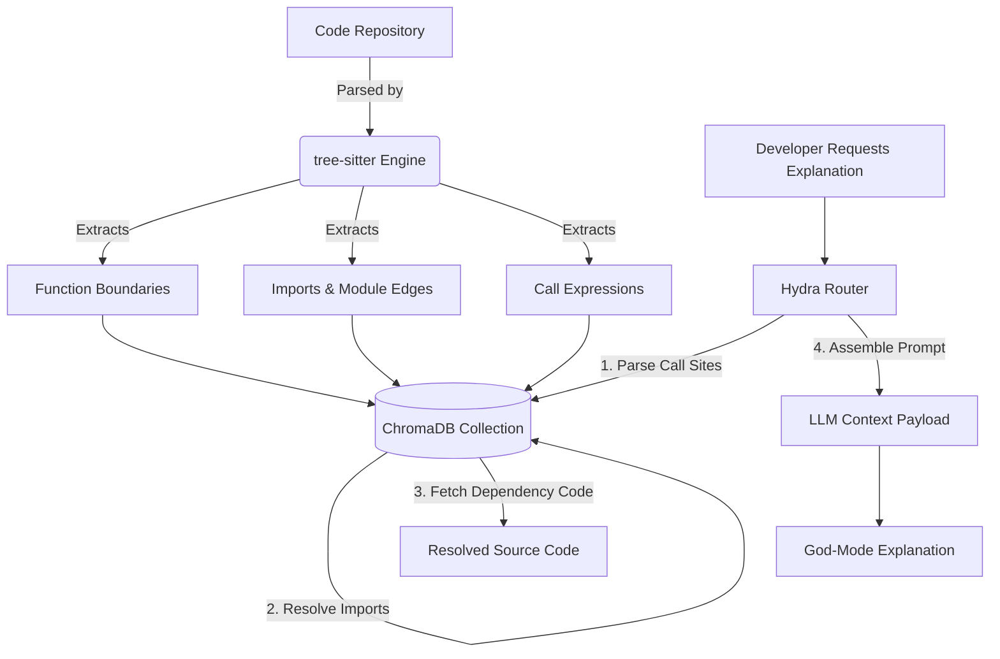

<div align="center">
  
  
  # 🌌 Astra Vision
  ### *The Autonomous AI Code Review, Semantic Graphing & Self-Healing Sandbox Engine*

  [](https://react.dev/)
  [](https://fastapi.tiangolo.com/)
  [](https://microsoft.github.io/monaco-editor/)
  [](https://www.trychroma.com/)
  [](https://tree-sitter.github.io/tree-sitter/)
  
  ---
  
  **Astra Vision** is a professional, repository-scale AI pair programming environment. It integrates deterministic Abstract Syntax Tree (AST) analysis, a persistent vector database, inline Monaco editor markers, and isolated code execution environments to deliver automated, verified codebase enhancements.
</div>

---

## 📖 Table of Contents
1. [Capabilities Matrix](#-capabilities-matrix-astra-vision-vs-competitors)
2. [Interface & Features Walkthrough (For Beginners)](#-interface--features-walkthrough-for-beginners)
    * [Step 1: Staging a Codebase](#step-1-staging-a-codebase)
    * [Step 2: Exploring Code & Line Simulation](#step-2-exploring-code--line-simulation)
    * [Step 3: Explaining Code & Resolving AST Graph Dependencies](#step-3-explaining-code--resolving-ast-graph-dependencies)
    * [Step 4: Running a PR Audit (AI Code Review)](#step-4-running-a-pr-audit-ai-code-review)
    * [Step 5: Executing the Autonomous Self-Healer](#step-5-executing-the-autonomous-self-healer)
    * [Step 6: Debugging Errors & Generating Flowcharts](#step-6-debugging-errors--generating-flowcharts)
3. [Key Innovation Pillars (Technical Deep Dive)](#-key-innovation-pillars-under-the-hood)
4. [Repository Directory Tree](#-repository-directory-tree)
5. [API Documentation](#-api-documentation)
6. [Setup & Execution](#-setup--execution)

---

## 🌟 Capabilities Matrix: Astra Vision vs. Competitors

| Feature | Astra Vision | CodeRabbit / Greptile | Standard LLM Tools |
| :--- | :---: | :---: | :---: |
| **Deterministic Code Graphing** | **Yes (AST via `tree-sitter`)** | Partial (Heuristic/Files) | No |
| **Verification Sandboxing** | **Yes (Node.js & Python Exec)** | No | No |
| **Recursive Context Resolution** | **Yes (Graph Dependency Walk)** | No | No |
| **Inline Editor Diagnostics** | **Yes (Monaco markers)** | No (PR Comments only) | No |
| **Autonomous Self-Healing** | **Yes (Generate → Fail → Heal → Pass)** | No | No |
| **Multi-Provider Fallbacks** | **Yes (Hydra Protocol Routing)** | No | No |

---

## 🖥️ Interface & Features Walkthrough (For Beginners)

This walkthrough explains how to use each pane in the Astra Vision web dashboard and what each component does under the hood.

---

### Step 1: Staging a Codebase
When you launch the dashboard at `http://localhost:3000`, the left sidebar is your codebase manager.

<div align="center">
  
</div>

*   **Option A: Load the Demo (Recommended first step)**:
    1. Click the **"Try Demo Repository"** button in the sidebar.
    2. This populates the explorer with a pre-configured mockup repository containing `app.js` (a buggy server script), `utils.js` (helper functions), and a `package.json` package manifest.
    3. Look for the green **"Demo Mode Active"** and **"Codebase indexed"** status badges. This means the vector database has embedded your files.
*   **Option B: Connect a GitHub Repo**:
    1. Paste a public GitHub URL (e.g., `https://github.com/owner/repo`) in the text box.
    2. Click **"Fetch Repository"**.
    3. The application will fetch the source, index the functions using `tree-sitter` AST parsing, and show the file explorer tree.
*   **Action**: Click the `src/` directory to expand it, and click on `app.js` to open it in the editor.

---

### Step 2: Exploring Code & Line Simulation
Once a file is loaded, it displays inside the **Monaco Code Editor** (the exact editor engine powering VS Code).

<div align="center">
  
</div>

*   **Syntax Highlighting**: Code elements (keywords, strings, functions) are colored according to your file type.
*   **Deep Line-by-Line Simulation**:
    1. Move your mouse into the editor and **click directly on any line of code** (for example, click the line `return "Hello " + name;` in `app.js`).
    2. In the right panel, look at the **"AI Analysis"** card.
    3. It extracts that exact line, its variable contexts, and displays interactive input forms.
    4. Type a value in the input boxes (e.g., set `name = "Astreon"`). The simulator automatically runs logic checks and outputs the reactive outcome (e.g., `"Hello Astreon"`) dynamically in the panel.

---

### Step 3: Explaining Code & Resolving AST Graph Dependencies
If you need to understand what a file does at a high structural level, use the **Code Explanation** pane.

<div align="center">
  
</div>

1. Ensure a file is open, then locate the **"Code Explanation"** section in the right sidebar.
2. Click the **"Explain"** button.
3. This sends the file context to the fast Cerebras API.
4. **What to look for in the output**:
    *   **Astra Overview**: A plain-English summary of the file's primary responsibility.
    *   **Logic Flow**: A step-by-step breakdown of how data flows through the file.
    *   **AST Dependencies Resolved**: If the open file calls functions defined in *other* files in your repository (for example, `app.js` calling a function inside `utils.js`), Astra Vision traverses the AST parser graph, retrieves their source definitions, and displays them as tags (e.g. `helper()`). These functions are automatically loaded into the LLM context to make explanations highly accurate.

---

### Step 4: Running a PR Audit (AI Code Review)
To find bugs, security concerns, or performance bottlenecks in your codebase, run a full review.

<div align="center">
  
</div>

1. Locate the **"AI Code Review (PR Audit)"** section in the right sidebar.
2. Click the **"Run Audit"** button. This invokes the Nvidia Nemotron model, which uses reasoning budget tokens to scan your code.
3. **What to look for in the editor**:
    *   Look back at the **Monaco Code Editor**. You will see squiggly underlines under lines that contain issues (Red for critical vulnerabilities, Orange/Yellow for warnings).
    *   **Hover your mouse** over any squiggly line. A popup tooltip with the label `[Astra Vision]` will display a detailed explanation of the issue (e.g., *"String concatenation is a security risk... Use template literals instead"*).
4. **Filtering Results**:
    *   Use the **"Filter Severity"** dropdown in the audit panel to narrow down comments to only `Critical` or `Warning`.
    *   Click the **"Line #"** button on any review card in the sidebar. The editor will automatically scroll and highlight that line.

---

### Step 5: Executing the Autonomous Self-Healer
Astra Vision can fix the issues it flags and test them inside a sandboxed environment.

<div align="center">
  
</div>

1. Locate a warning comment card inside the PR Audit panel (e.g., the Warning on Line 2).
2. Click the **"⚡ Run & Heal"** button on that card.
3. **What to look for (Autonomous Sandbox Run)**:
    *   An animated step tracker appears showing progress:
        1. `🧪 Gen Test` — Generates a test that targets this specific bug.
        2. `❌ Run Fail` — Runs the test inside a Node.js/Python sandbox and confirms the test fails on the original buggy code.
        3. `🔧 Heal` — Tells Gemini to fix the code to resolve the test failure.
        4. `✅ Run Pass` — Re-runs the test against the fixed code and confirms it passes successfully.
4. **Reviewing and Applying the Patch**:
    *   Once execution is done, the card displays a **"TEST PASSED"** badge.
    *   A green box shows the proposed fixed code.
    *   If you like the changes, click the **"Apply Fix to Editor"** button.
    *   **The editor is updated in real-time** with the repaired code! The squiggly lines are automatically cleared to prepare for your next audit.

---

### Step 6: Debugging Errors & Generating Flowcharts
Astra Vision also includes utility tools at the bottom of the right panel.

<div align="center">
  
</div>

*   **Error Debugger**:
    1. Paste a raw error stack trace or compiler output (e.g. from your console terminal) into the text box.
    2. Click **"Explain Error"**.
    3. The backend cross-references the error text against the indexed codebase vectors in ChromaDB, finds the offending files, and outputs its **meaning**, **cause**, and the exact code modifications required to fix it.
*   **Flow Diagram**:
    1. Click the **"Generate"** button.
    2. Gemini parses the structural branches in the active file and builds a Mermaid.js graph.
    3. A clean, visual block chart renders in the sidebar showing the logical execution branches.

---

## 🚀 Key Innovation Pillars (Under the Hood)

### 🧠 1. Hydra Protocol Multi-Model Routing
Astra Vision coordinates specialized LLM engines through the **Hydra Protocol** based on speed, reasoning capabilities, and token budgets:

*   **Speed Layer (Cerebras - gpt-oss-120b)**: Dispatches instant, sub-second responses for interactive code explanation and logic flows.
*   **Reasoning Layer (Nvidia NIM - nemotron-3-ultra-550b-a55b)**: Utilizes reasoning budget tokens to scan code changes (Git diffs) for deep-seated security flaws, race conditions, memory leaks, and architectural issues.
*   **Healing Layer (Google AI Studio - Gemini-2.5-Flash)**: Orchestrates recursive token generation to construct tests, execute sandbox runs, and emit structural code repairs.

---

### 🕸️ 2. AST Dependency Graphing & ChromaDB Indexing
Rather than splitting files using standard character counters, Astra Vision analyzes the **Abstract Syntax Tree (AST)** using tree-sitter bindings for JavaScript and Python:



#### How Metadata-Guided Context Works
When a file is indexed, each function is parsed into a separate ChromaDB document. Its metadata is enriched with structural references:
```json
{
  "filename": "src/app.js",
  "name": "startApp",
  "type": "function",
  "start_line": 4,
  "end_line": 12,
  "calls": "helper,validateInput",
  "imports": "./utils,./validator"
}
```
If a developer asks to explain `startApp()`, Astra Vision detects the calls to `helper` and `validateInput`, queries ChromaDB for functions matching those names, and automatically appends their source definitions into the LLM context.

---

### 🎨 3. Monaco Inline Diagnostics
Injects warnings directly into the editor viewport to avoid context-switching:
1.  **Severity Mapping**:
    *   `Critical` ➔ `monaco.MarkerSeverity.Error` (Red squiggly)
    *   `Warning` ➔ `monaco.MarkerSeverity.Warning` (Yellow/Orange squiggly)
    *   `Optimization` ➔ `monaco.MarkerSeverity.Info` (Blue squiggly)
    *   `Style` ➔ `monaco.MarkerSeverity.Hint` (Faded underline)
2.  **Coordinates Mapping**: Dynamically calculates character offsets and non-whitespace starts for each line to align underlines with code tokens.
3.  **Active Hover tooltips**: Hovering over underlined code segments displays a hover popup styled with the `[Astra Vision]` tag and issue details.

---

### ⚡ 4. The Self-Healing Sandbox Cycle
The self-healing cycle runs entirely in local, isolated subprocess sandboxes:

*   **JavaScript Sandbox**: Spawns `node -e <code>` using a 5-second hard timeout constraint.
*   **Python Sandbox**: Spawns `python -c <code>` with strict execution boundaries.
*   **Assertion-based confirmation**: Tests do not require third-party frameworks like Jest or pytest. Gemini generates pure assertions (`console.assert` or `assert`) and flags execution status with `__TEST_PASSED__` and `__TEST_FAILED__` output tokens.

---

## 📂 Repository Directory Tree

```bash
├── backend/
│   ├── services/
│   │   ├── ast_parser.py           # tree-sitter JS/Python parser & call site extractor
│   │   ├── code_indexer.py         # ChromaDB semantic indexing manager
│   │   ├── hydra_router.py         # Multi-provider model router (Cerebras, NIM, Gemini)
│   │   └── self_heal_engine.py     # Subprocess sandbox code executor
│   ├── server.py                   # FastAPI routing server
│   └── requirements.txt            # Python dependencies (tree-sitter, chromadb)
│
├── frontend/
│   ├── src/
│   │   ├── utils/
│   │   │   └── analysisEngine.js   # Local simulation fallback helpers
│   │   ├── App.js                  # App layout, Monaco mounts & markers syncing
│   │   └── index.js                # React entry
│   └── package.json                # Frontend package manifest
│
├── test_ast_parser.py              # CLI test for AST parser imports & calls extraction
├── test_ast_indexing.py            # CLI test for ChromaDB metadata graph storage
└── test_self_heal.py               # CLI test for the self-healing sandbox pipeline
```

---

## 🔌 API Documentation

### 1. Repository Indexing
*   **Endpoint**: `POST /api/index-repo`
*   **Payload**:
    ```json
    {
      "files": {
        "src/app.js": "function start() { helper(); }",
        "src/utils.js": "export function helper() { console.log('work'); }"
      }
    }
    ```
*   **Response**:
    ```json
    {
      "success": true,
      "data": {
        "success": true,
        "indexed_chunks": 2
      }
    }
    ```

### 2. Autonomous Self-Healing
*   **Endpoint**: `POST /api/self-heal`
*   **Payload**:
    ```json
    {
      "code": "function greet(name) { return 'Hello ' + name; }",
      "audit_comment": "String concatenation is security risk. Use template literals instead.",
      "language": "javascript"
    }
    ```
*   **Response**:
    ```json
    {
      "success": true,
      "data": {
        "test_code": "function greet(name) { ... }; try { console.assert(...); console.log('__TEST_PASSED__'); } ...",
        "fail_result": { "success": true, "passed": false, "stdout": "__TEST_FAILED__", "stderr": "..." },
        "fixed_code": "function greet(name) {\n  return `Hello ${name}`;\n}",
        "pass_result": { "success": true, "passed": true, "stdout": "__TEST_PASSED__", "stderr": "" }
      }
    }
    ```

---

## 🛠️ Setup & Execution

### Environment Variables
Create a `.env` file in the `backend/` directory:
```env
CEREBRAS_API_KEY="your-key"
NVIDIA_API_KEY="nvapi-..."
GEMINI_API_KEY="AIzaSy..."
```

### Running Astra Vision
A shell script launcher is included at the workspace root to orchestrate execution:
```bash
# Executing standard Windows Launcher
./start_astra_vision.bat
```

To run manually:
```bash
# Terminal 1: Python API Server
cd backend
python server.py

# Terminal 2: React Web Frontend
cd frontend
npm install
npm start
```

---

## 🔬 CLI Diagnostic Suites
Run these scripts to inspect engine operations directly in your command line:

```bash
# Run tree-sitter AST extraction
python test_ast_parser.py

# Run ChromaDB graph metadata search
python test_ast_indexing.py

# Run self-healing test assertions lifecycle
python test_self_heal.py
```
